# 16-825 Assignment 1: Rendering Basics with PyTorch3D

The result for any question can be reproduced by uncommenting the function call in `main.py`. Comments containing question number indicate corresponding function calls.

To run `main.py`:

```bash
cd sragi_code_proj1

python -m starter.main
```
All results are saved in the `submissions` folder.

## 1. Practicing with Cameras

### 1.1. 360-degree Renders

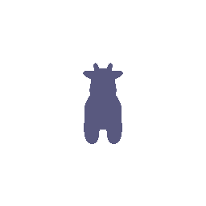


### 1.2 Re-creating the Dolly Zoom

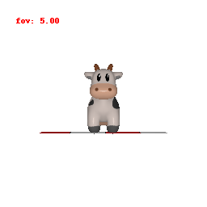


## 2. Practicing with Meshes

### 2.1 Constructing a Tetrahedron

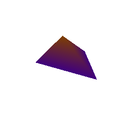

This mesh consists of 4 vertices and 4 faces that correspond to the 4 triangles above.

### 2.2 Constructing a Cube

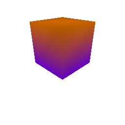

This mesh consists of 8 vertices and 12 faces that correspond to the 2 triangles required to make each of the 6 square faces above.


## 3. Re-texturing a mesh

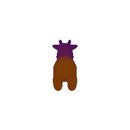

In this case, `color1 = [0.5, 0, 1]` and `color2 = [1, 0.5, 0]`.


## 4. Camera Transformations

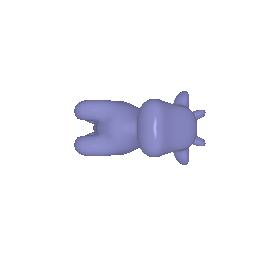
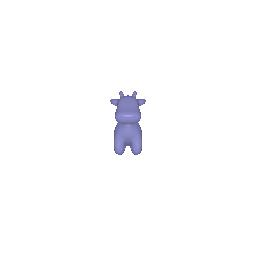
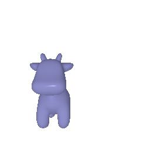
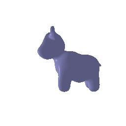


R_relative and T_Relative should describe, in the camera's coordinate frame, the rotation and translation of the object's coordinate frame relative to the camera' coordinate frame. For example, 

`R_relative=[[0, 1, 0], [-1, 0, 0], [0, 0, 1]]`

`T_relative=[0, 0, 0]`

should mean that the object should not undergo any translation from its current position and should rotate such that its x axis points in the same direction as the camera's y axis, its y axis points in the opposite direction as the camera's x axis, and its z axis points in the same direction as the camera's z axis.


## 5. Rendering Generic 3D Representations

### 5.1 Rendering Point Clouds from RGB-D Images

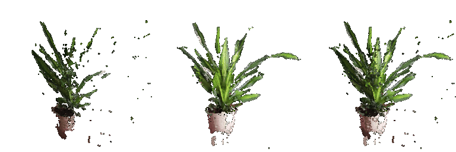


### 5.2 Parametric Functions

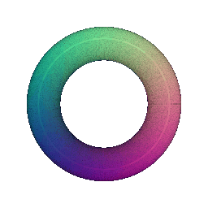

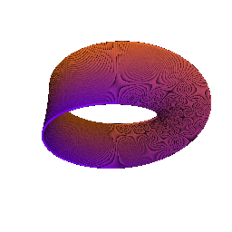

This is a Mobius Strip that was rendered using the parametric function:

* x = (2 + r/2 * cos(alpha/2)) * cos(alpha)
* y = r/2 * sin(alpha/2)
* z = (1.5 + r/2 * cos(alpha/2)) * sin(alpha)


where 
* r ranges from -1.5 to 1.5
* alpha ranges from 0 to 2*pi


### 5.3 Implicit Surfaces


1. In terms of rendering quality, meshes have a smoother appearance compared to a point cloud's discrete structure. However, meshes lose finer details due to oversimplification (use of faces), whereas dense point clouds can retain high-resolution data.

2. Meshes have a more compact representation, making them easier to store than unstructured point clouds, which require significantly more memory. However, if a mesh has a high number of vertices and faces for greater precision, it will also require substantial storage.

3. Meshes are easy to edit and are supported by many popular CAD software programs, whereas point clouds are difficult to edit without first converting them to meshes. However, point cloud data is directly captured through sensors like LiDAR, making point cloud data acquisition easier than mesh data for any object.


This is a Barth Sextic that was rendered using the implicit function:

* 4 * (phi^2 * x^2 - y^2) * (phi^2 * y^2 - z^2) * (phi^2 * z^2 - x^2) - (1 + 2 * phi) * (x^2 + y^2 + z^2 - 1)^2 = 0

where 
* x, y, and z range from -1.5 to 1.5
* phi is the golden ratio (approximately 1.618033988749895)

## 6. Do Something Fun

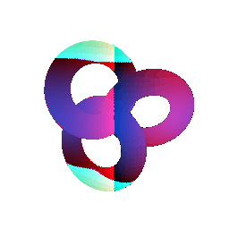

This is a Trefoil knot that tightens and loosens over time! Additionally, colors flow through it dynamically—red flows along the X-axis, while cyan flows along the Y-axis.