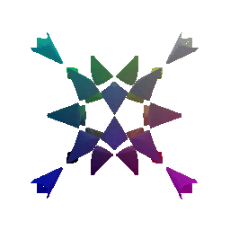

# 16-825 Assignment 1: Rendering Basics with PyTorch3D

This repository contains solutions for Assignment 1 of the 16-825 course, focusing on rendering basics using PyTorch3D. The results for each question can be reproduced by uncommenting the corresponding function calls in `main.py`. Comments in the code indicate the relevant question numbers.

## How to Run

To execute the code in `main.py`, follow these steps:

```bash
cd sragi_code_proj1
python -m starter.main
```

All results will be saved in the `submissions` folder.

---

## Table of Contents

1. [Practicing with Cameras](#1-practicing-with-cameras)
    - [360-degree Renders](#11-360-degree-renders)
    - [Re-creating the Dolly Zoom](#12-re-creating-the-dolly-zoom)
2. [Practicing with Meshes](#2-practicing-with-meshes)
    - [Constructing a Tetrahedron](#21-constructing-a-tetrahedron)
    - [Constructing a Cube](#22-constructing-a-cube)
3. [Re-texturing a Mesh](#3-re-texturing-a-mesh)
4. [Camera Transformations](#4-camera-transformations)
5. [Rendering Generic 3D Representations](#5-rendering-generic-3d-representations)
    - [Rendering Point Clouds from RGB-D Images](#51-rendering-point-clouds-from-rgb-d-images)
    - [Parametric Functions](#52-parametric-functions)
    - [Implicit Surfaces](#53-implicit-surfaces)
6. [Do Something Fun](#6-do-something-fun)

---

## 1. Practicing with Cameras

### 1.1 360-degree Renders


### 1.2 Re-creating the Dolly Zoom


---

## 2. Practicing with Meshes

### 2.1 Constructing a Tetrahedron


This mesh consists of 4 vertices and 4 faces, forming 4 triangles.

### 2.2 Constructing a Cube


This mesh consists of 8 vertices and 12 faces, with 2 triangles forming each of the 6 square faces.

---

## 3. Re-texturing a Mesh


In this example:
- `color1 = [0.5, 0, 1]`
- `color2 = [1, 0.5, 0]`

---

## 4. Camera Transformations


`R_relative` and `T_relative` describe the rotation and translation of the object's coordinate frame relative to the camera's coordinate frame. For example:

```python
R_relative = [[0, 1, 0], [-1, 0, 0], [0, 0, 1]]
T_relative = [0, 0, 0]
```

This configuration means:
- No translation from the current position.
- Rotation aligns the object's x-axis with the camera's y-axis, the object's y-axis opposite to the camera's x-axis, and the z-axes remain aligned.

---

## 5. Rendering Generic 3D Representations

### 5.1 Rendering Point Clouds from RGB-D Images


### 5.2 Parametric Functions


#### Mobius Strip Parametric Function:

- **x** = (2 + r/2 * cos(α/2)) * cos(α)
- **y** = r/2 * sin(α/2)
- **z** = (1.5 + r/2 * cos(α/2)) * sin(α)

Where:
- `r` ranges from -1.5 to 1.5
- `α` ranges from 0 to 2π

### 5.3 Implicit Surfaces


#### Comparison of Meshes and Point Clouds:
1. **Rendering Quality**: Meshes appear smoother but may lose finer details, while dense point clouds retain high-resolution data.
2. **Storage**: Meshes are compact, whereas point clouds require more memory. High-precision meshes, however, also demand significant storage.
3. **Editing**: Meshes are easier to edit and widely supported by CAD software. Point clouds, though harder to edit, are directly captured by sensors like LiDAR.



#### Barth Sextic Implicit Function:

- **Equation**:
  ```
  4 * (φ² * x² - y²) * (φ² * y² - z²) * (φ² * z² - x²) - (1 + 2 * φ) * (x² + y² + z² - 1)² = 0
  ```
- **Ranges**:
  - `x`, `y`, `z` range from -1.5 to 1.5
  - `φ` is the golden ratio (approximately 1.618)

---

## 6. Do Something Fun


This is a Trefoil Knot that dynamically tightens and loosens over time. Additionally, colors flow through it:
- **Red** along the X-axis.
- **Cyan** along the Y-axis. 16-825 Assignment 1: Rendering Basics with PyTorch3D